# DOTFILES
## DESCRIPTION
This dot is made only for my convenience, PC configuration and needs, I do not take responsibility for the non-working configuration or software

## MY LAPTOP CONFIG
- [Arch Linux](https://archlinux.org)
- [Hyprland](https://github.com/hyprwm/Hyprland)
- CPU -> Intel 13TH Gen
- GPU -> RTX 3050 6GB
- RAM -> 16GB
- SSD -> 512GB
- Monitor -> 1920x1080 "15.6" 144Hz

## FIREFOX THEME/EXTENSIONS
- [Catppuccin Mocha Flamingo](https://addons.mozilla.org/en-US/firefox/addon/catppuccin-mocha-flamingo-git/)
- [Vimium](https://addons.mozilla.org/en-US/firefox/addon/vimium-ff/)

## DEPENDENCIES
All necessary dependencies and software are located in the [file](scripts/packages.py)

## PREVIEW
<div align="center">

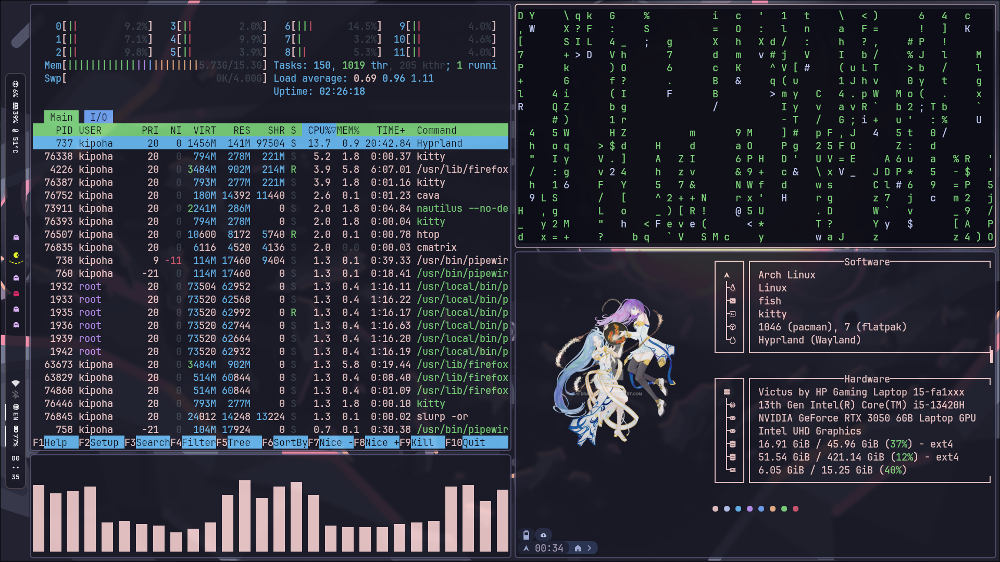
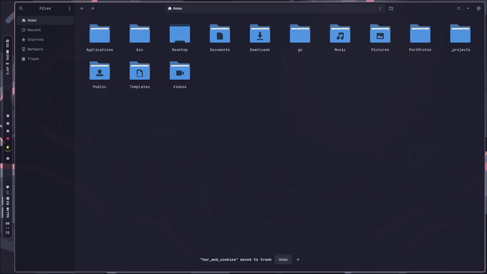
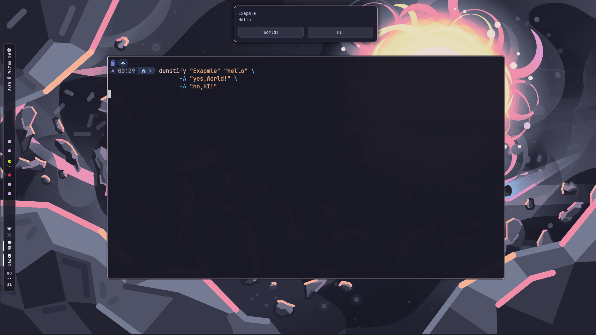
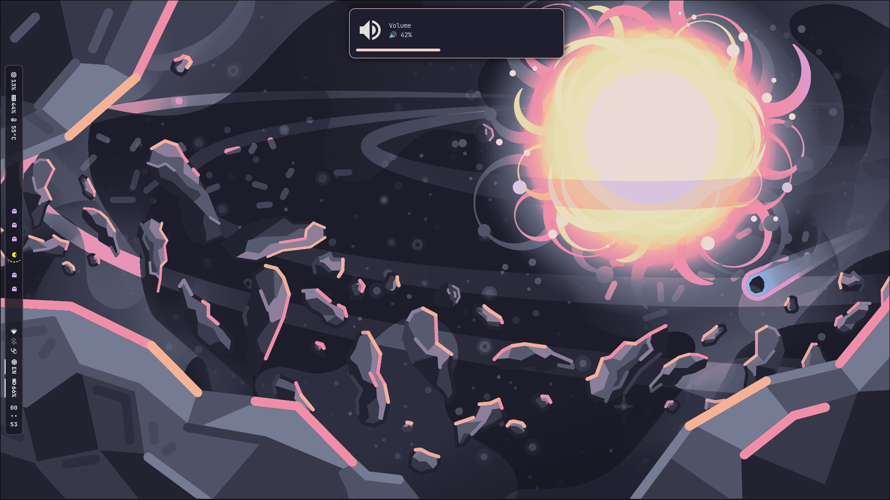
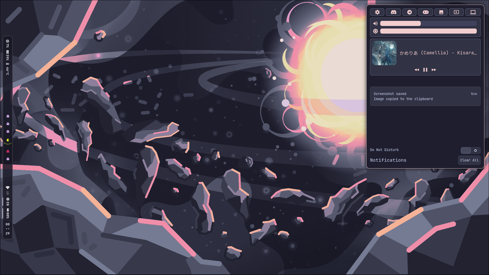
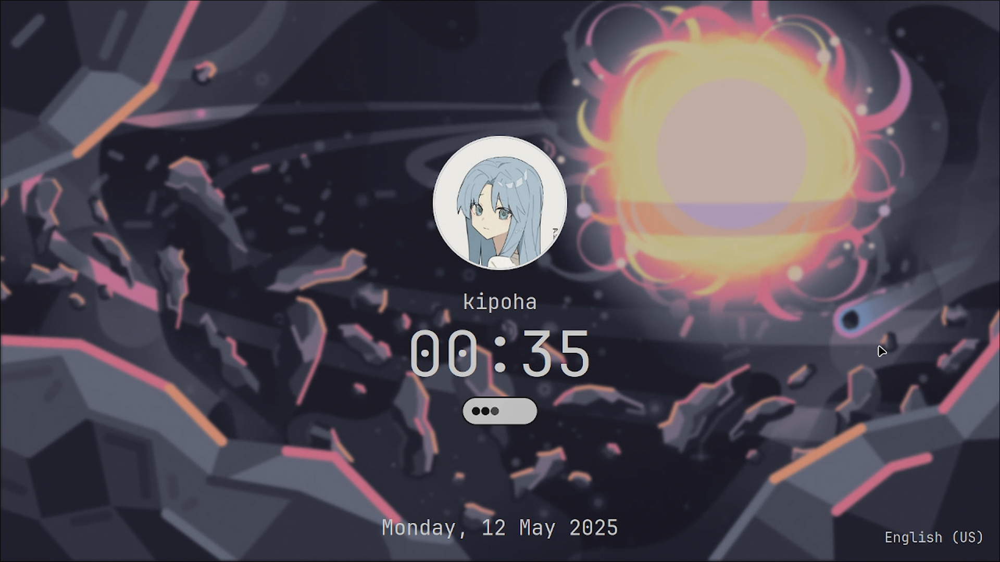
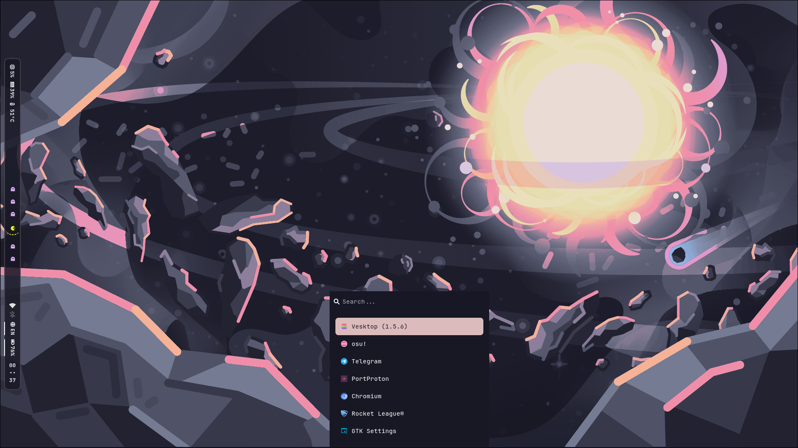
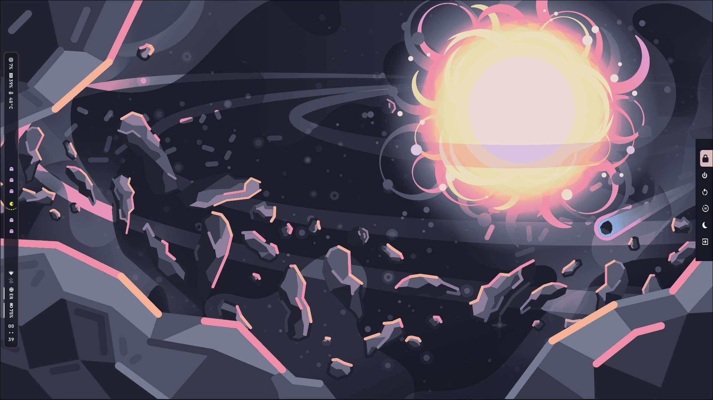
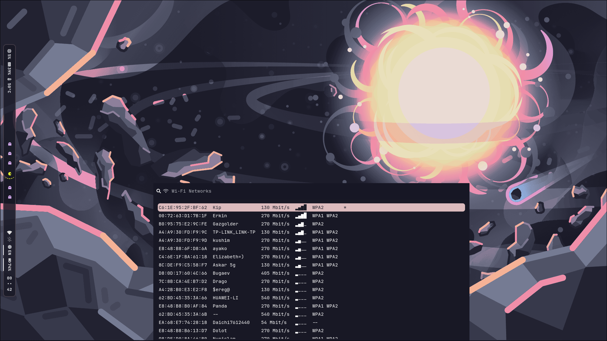
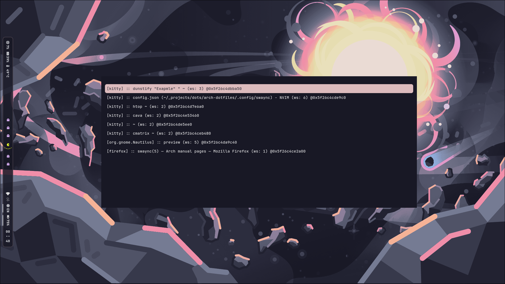
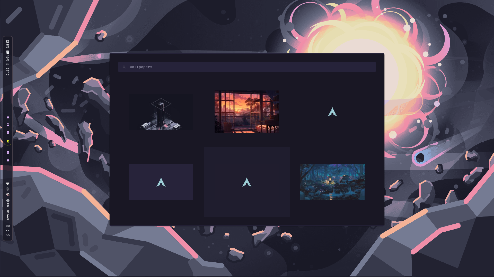
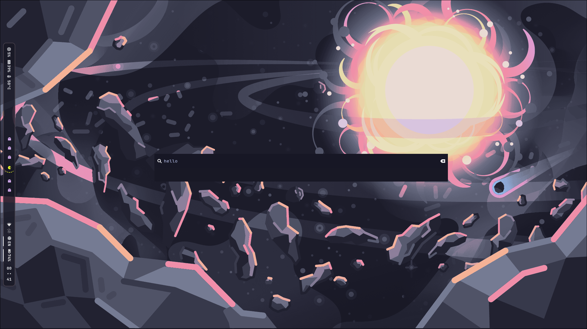
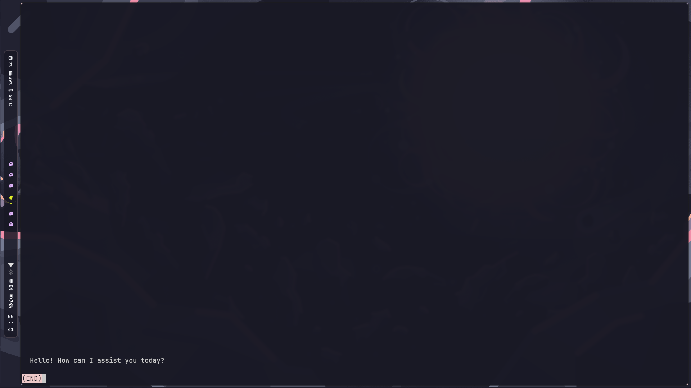
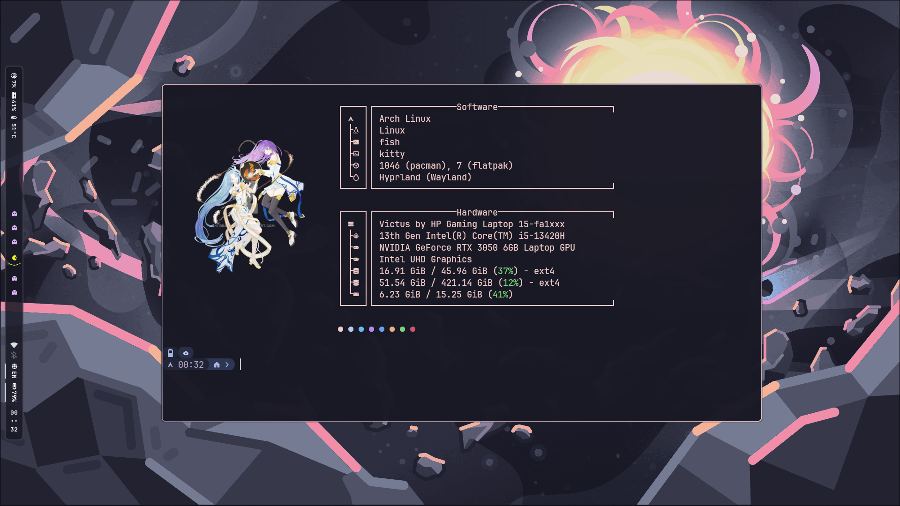
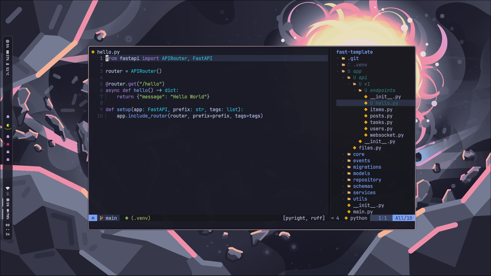
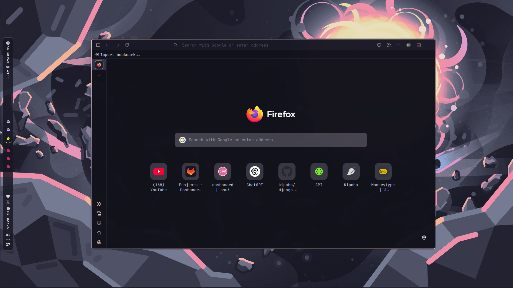
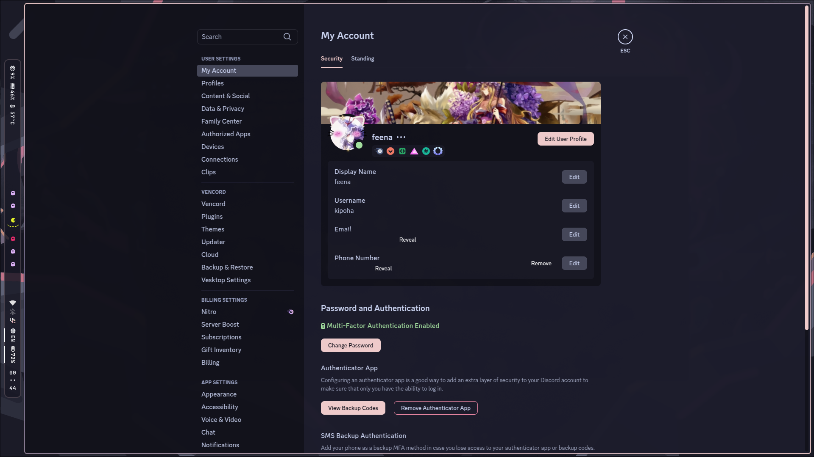
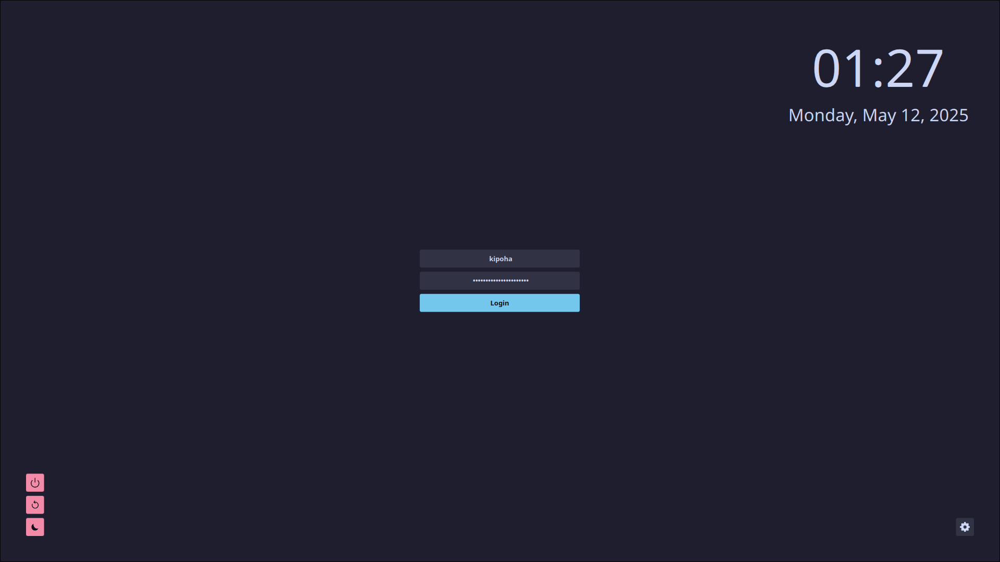
</div>
<br /><br />

# SDDM
dependencies
```bash
sudo pacman -S qt5-declarative qt5-quickcontrols2 qt5-graphicaleffects xdg-desktop-portal xdg-desktop-portal-gtk
```

copy sddm theme
```bash
sudo cp -r .system/sddm/themes/catppuccin-mocha /usr/share/sddm/themes/
sudo mkdir -p /etc/sddm.conf.d
sudo cp .system/sddm/sddm.conf.d/theme.conf.user /etc/sddm.conf.d
```

preview sddm
```bash
sddm-greeter --test-mode --theme /usr/share/sddm/themes/catppuccin-mocha/
```


## KEYBINDINGS

### SYSTEM
| Key                            | Action                                           |
|--------------------------------|--------------------------------------------------|
| `Super + Return(Enter)`        | Launch terminal                                  |
| `Super + Shift + M`            | Exit from Hyprland                               |
| `Super + Shift + F`            | Open Wofi Launcher                               |
| `Super + Shift + W`            | Kill Waybar or Run Waybar with Horizontal config |
| `Super + Ctrl + W`             | Kill Waybar or Run Waybar with Vertical config   |
| `Super + N`                    | Open Notification Center                         |
| `Super + Shift + N`            | Open Power Menu                                  |
| `Super + Shift + R`            | Open WI-FI connector                             |
| `Super + E`                    | Open File Manager                                |
| `Super + B`                    | Open Browser(Firefox)                            |
| `Super + A`                    | Open AI request                                  |
| `Super + Shift + V`            | Open Clipboard                                   |
| `Super + Shift + C`            | Clear Clipboard                                  |
| `Super + W`                    | Choose Wallpaper                                 |
| `Super + T`                    | Choose Emoji                                     |


### WINDOW KEYBINDINGS
| Key                            | Action                                           |
|--------------------------------|--------------------------------------------------|
| `Super + Shift + Q`            | Close window                                     |
| `Super + V`                    | Toggle floating mode                             |
| `Super + P`                    | Pseudo Window(only dwindle)                      |
| `Super + U`                    | ToggleSplit(only dwindle)                        |
| `Super + F`                    | Fullscreen                                       |
| `Super + Tab`                  | Select window                                    |
| `Super + Shift + H`            | Move window to the left                          |
| `Super + Shift + L`            | Move window to the right                         |
| `Super + Shift + K`            | Move window up                                   |
| `Super + Shift + J`            | Move window down                                 |
| `Super + Ctrl + H`             | Resize window to the left                        |
| `Super + Ctrl + L`             | Resize window to the right                       |
| `Super + Ctrl + K`             | Resize window up                                 |
| `Super + Ctrl + J`             | Resize window down                               |
| `Super + 1-9`                  | Switch workspaces                                |
| `Super + Shift + 1-9`          | Move window to workspace                         |
| `Super + S`                    | Toggle special workspace                         |
| `Super + Shift + S`            | Move window to special workspace                 |
| `Super + O`                    | Change to dwindle layout                         |
| `Super + Shift + O`            | Change to master layout                          |


### SCREENSHOT KEYBINDINGS
| Key                            | Action                                           |
|--------------------------------|--------------------------------------------------|
| `Super + Print`                | Screenshot(clipboard)                            |
| `Super + Shift + Print`        | Region Screenshot(clipboard)                     |
| `Super + Ctrl + Print`         | Window Screenshot(clipboard)                     |
| `Super + Alt + Print`          | Output Screenshot                                |
| `Super + Shift + Alt + Print`  | Region Output Screenshot                         |
| `Super + Ctrl + Alt + Print`   | Window Output Screenshot                         |


# BUILD
```bash
git clone https://github.com/kipoha/arch-dotfiles.git
cd arch-dotfiles
make
```
